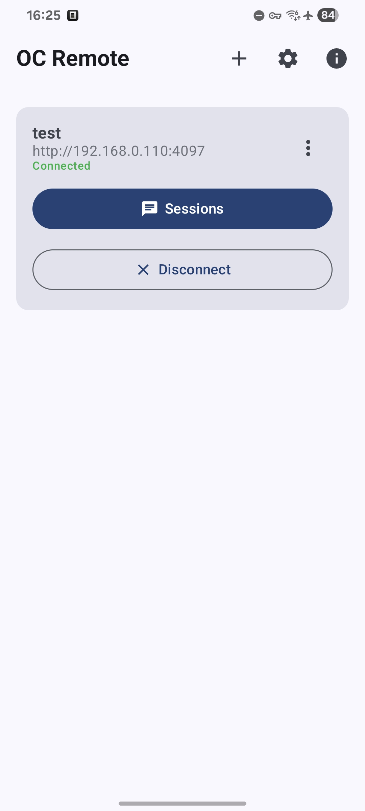
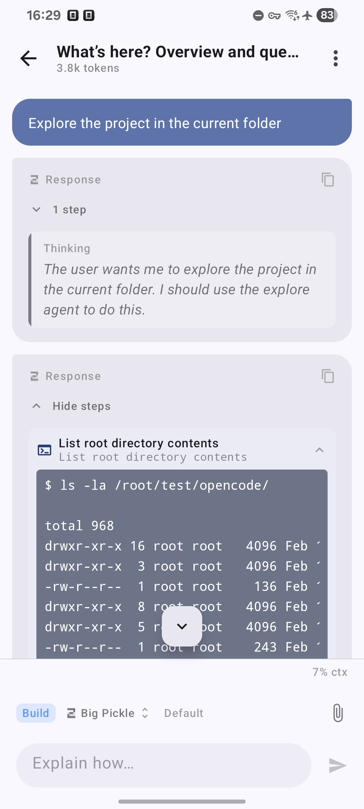
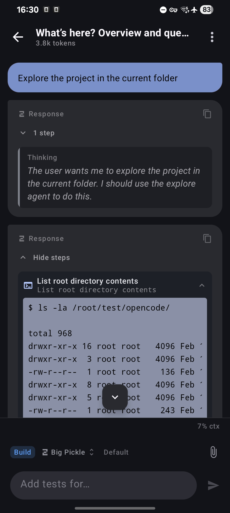
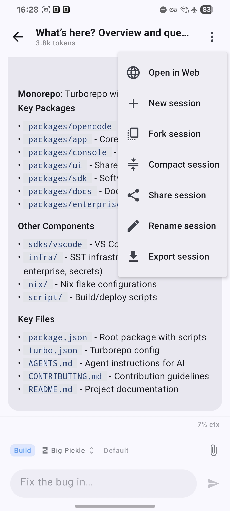
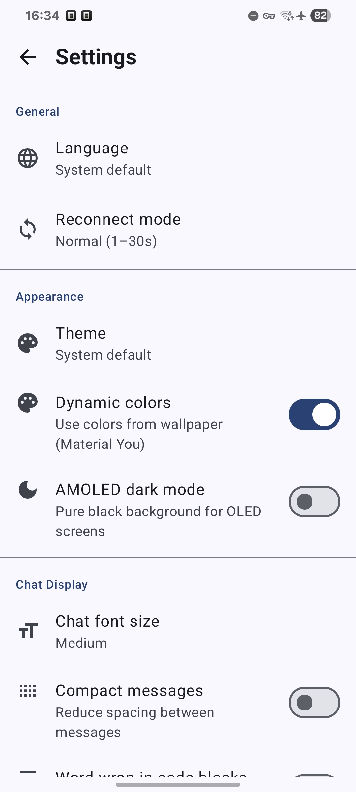
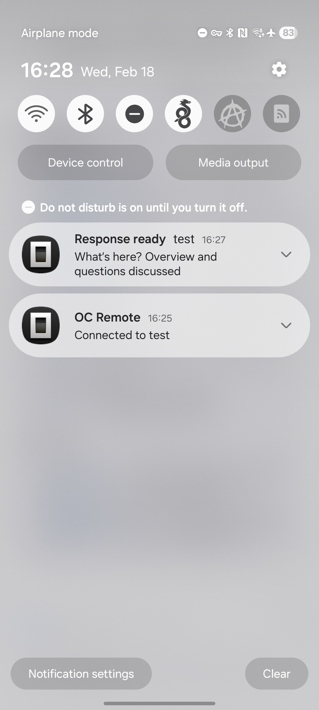

# OC Remote

Android client for [OpenCode](https://github.com/anomalyco/opencode) servers with native UI and full feature parity.

**This is an unofficial community project, not affiliated with the OpenCode team.**

## Screenshots

<p align="center">
  
  
  
</p>
<p align="center">
  
  
  
</p>

## Features

### Native UI
- **Full chat interface** — native Material 3 UI with markdown rendering (code blocks, tables, syntax highlighting)
- **Message streaming** — real-time text streaming with auto-scroll
- **Smart scroll behavior** — manual scroll disables auto-scroll; automatically re-enables when scrolled to bottom
- **File mentions** — `@file` completion with fuzzy search
- **Image support** — inline base64 images in chat
- **Tool outputs** — expandable tool call results with syntax highlighting
- **Image preview & save** — open sent and draft images in fullscreen preview and save to device storage
- **Shell output copy** — bash output blocks support text selection and one-tap copy (command + output)
- **HTML error fallback modes** — switch long HTML error payloads between rendered page view and raw code view
- **Slash commands** — `/new`, `/fork`, `/compact`, `/share`, `/rename`, `/undo`, `/redo`, `/shell` (if enabled in settings)
- **Swipe to revert** — swipe user messages to undo (with confirmation dialog)

### Terminal Mode
- **Termux-like terminal mode** — full-screen terminal UI with dedicated extra keys and mobile-first interactions
- **Server-scoped terminal tabs** — tabs are shared across sessions for the same server and managed from a drawer
- **PTY over WebSocket** — low-latency interactive I/O for CLI/TUI apps
- **Reliable PTY resize** — rows/cols update with viewport changes and IME transitions
- **TUI rendering improvements** — better full-grid rendering behavior for apps like `mc`
- **Terminal shortcuts** — Ctrl/Alt latching, volume-key virtual modifiers (Ctrl/Fn), and `Ctrl+Alt+V` paste
- **Selection toolbar paste** — terminal selection menu includes paste action integrated with terminal input

### Session Management  
- **Multi-session** — switch between sessions, view history
- **Session actions** — create, fork, compact, share/unshare, rename via dropdown menu
- **Quick terminal launch** — open the latest session directly in terminal mode from the sessions top bar
- **Load older messages** — pagination for large sessions (initial 50, expandable)
- **OOM protection** — `largeHeap` enabled, reduced logging, pagination prevents crashes on huge sessions
- **Session export** — export full session as JSON file with streaming progress notification
- **Multi-select in sessions** — long-press to enter selection mode, select multiple sessions, and delete in one action
- **Draft persistence** — input text, image attachments, and @file mentions saved per session; survives navigation, app restart, and WebUI detours

### Model & Agent Selection
- **Model picker** — select provider and model with variant support; provider icons shown in headers
- **Agent selector** — tap to cycle through agents; each agent colored with its TUI theme color (blue, purple, green…)
- **Reliable agent mode persistence** — explicit Plan/Build choice is preserved correctly between UI state and sent commands
- **Provider icons** — 74 vector icons for AI providers shown in model picker and next to assistant responses
- **Token usage** — displays total tokens and cost in toolbar subtitle
- **Context window** — percentage display above input, color-coded (normal < 70%, warning 70-90%, critical > 90%)
- **Compact layout** — horizontally scrollable toolbar prevents overflow on long translations

### Localization
- **14 languages** — English (source), Russian, German, Spanish, French, Italian, Portuguese (BR), Indonesian, Japanese, Korean, Chinese (Simplified), Ukrainian, Turkish, Arabic, Polish
- **Auto-translation** — lokit integration for automatic string translation
- **Settings** — language and theme selection in Settings screen

### Settings
- **Language** — 14 languages with app restart (system default, English, Russian, German, Spanish, French, Italian, Portuguese BR, Indonesian, Japanese, Korean, Chinese Simplified, Ukrainian, Turkish, Arabic, Polish)
- **Reconnect mode** — aggressive (1–5s), normal (1–30s), or conservative (1–60s) backoff strategy
- **Theme** — light, dark, or system default
- **Dynamic colors** — Material You dynamic color support (Android 12+)
- **AMOLED dark mode** — pure black surfaces with accent borders across chat bubbles, cards, menus, dialogs, and input blocks (works with both static and dynamic colors)
- **Chat font size** — small, medium, or large text in chat messages and code blocks
- **Code word wrap** — toggle horizontal scrolling vs. word wrap in code blocks and tool outputs
- **Compact messages** — reduce spacing between messages for denser layout
- **Auto-expand tool results** — show tool card contents expanded by default
- **Initial message count** — configure how many messages to load per session (25–200)
- **Confirm before send** — optional confirmation dialog before sending messages
- **Haptic feedback** — vibrate on send and revert actions (API 30+ uses CONFIRM, older uses CONTEXT_CLICK)
- **Keep screen on** — prevent screen timeout while agent is working
- **Notifications** — toggle task completion notifications
- **Silent notifications** — suppress sound and vibration for task notifications
- **Shell mode toggle** — show or hide shell-mode controls in chat input
- **Image optimization controls** — tune max image side (640–2560 px) and WebP quality for attachments

### Connection
- **Multi-server** — connect to multiple OpenCode servers simultaneously
- **Local runtime via Termux** — set up and run OpenCode directly on-device from the Home screen (setup/start/stop/sessions)
- **Optional local proxy** — route local runtime traffic through a custom proxy URL with editable `NO_PROXY` exclusions (defaults prefilled)
- **Provider OAuth reliability** — improved browser auth completion flow and provider connected-state refresh
- **SSE event stream** — real-time session status, permissions, questions
- **WebSocket transport** — used for terminal PTY streams
- **Auto-reconnect** — exponential backoff (1s to 30s)
- **Background service** — foreground service keeps connections alive when app is minimized

## Requirements

- Android 8.0+ (API 26)
- OpenCode server accessible over the network

## Setup

1. Start the OpenCode server with network access:

```bash
opencode web --port 4096 --hostname 0.0.0.0
```

2. In the app, tap **+** and enter the server URL (e.g. `http://192.168.0.10:4096`), username, and optional password.

3. Tap **Connect** on the server card.

## Building

### Android Studio

1. Open the project
2. Sync Gradle
3. Run on a device or emulator

### Command line

```bash
# Build debug APK
./gradlew assembleDebug

# Install on connected device
adb install -r app/build/outputs/apk/debug/app-debug.apk
```

## License

MIT
