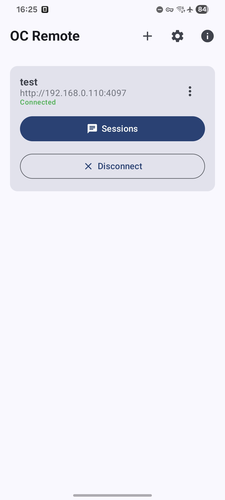
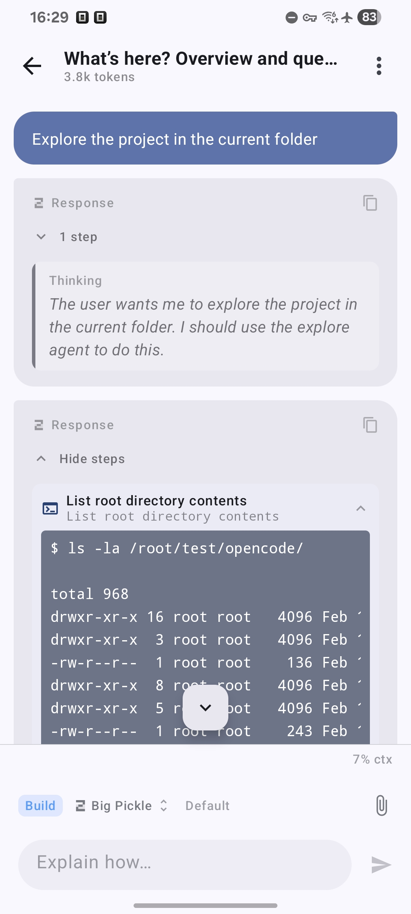
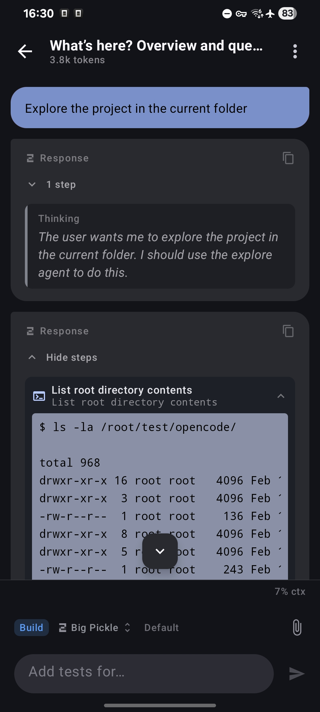
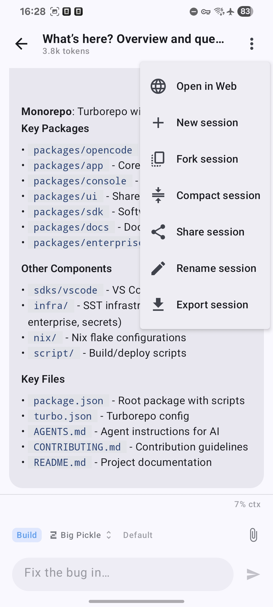
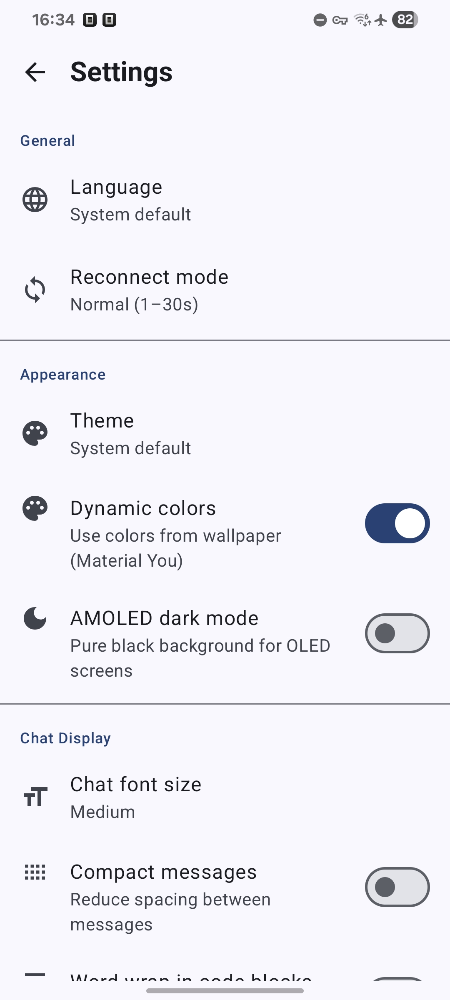
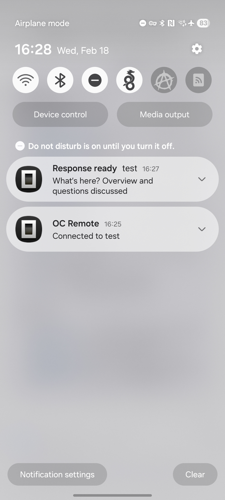

# OC Remote

Android client for [OpenCode](https://github.com/anomalyco/opencode) servers with a native UI and broad feature coverage.

**This is an unofficial community project, not affiliated with the OpenCode team.**

## Screenshots

<p align="center">
  
  
  
</p>
<p align="center">
  
  
  
</p>

## Features

### Native UI
- **Full chat interface** — native Material 3 UI with GFM markdown, code blocks, task markers, strikethrough, scrollable tables, syntax highlighting, and copy actions
- **Message streaming** — real-time text streaming with auto-scroll
- **Smart scroll behavior** — manual scroll disables auto-scroll; automatically re-enables when scrolled to bottom
- **File mentions** — `@file` autocomplete with server-backed path search and quick insert
- **Attachment support** — send images, PDFs, text, source code, and configuration files from device storage
- **Android sharing** — share one or multiple supported files into an existing or new chat on a connected server
- **Tool outputs** — expandable tool-call cards with selectable monospace output
- **Image preview & save** — open sent and draft images in fullscreen preview and save to device storage
- **Shell output copy** — bash output blocks support text selection and one-tap copy (command + output)
- **HTML error fallback modes** — switch long HTML error payloads between rendered page view and raw code view
- **Collapsible reasoning** — reasoning expands on demand, with optional auto-expand and turn dividers for multi-message responses
- **Slash commands** — `/new`, `/fork`, `/compact`, `/share`, `/rename`, `/undo`, `/redo`, `/shell`
- **Message actions** — long-press user messages to revert with confirmation
- **Reliable delivery** — outgoing prompts stay visible with queued state while delayed server events and history are reconciled
- **Interaction queue** — simultaneous permissions and questions stay ordered with position, retry, parent-chat routing, and permanent-approval confirmation

### Terminal Mode
- **Termux-like terminal mode** — full-screen terminal UI with dedicated extra keys and mobile-first interactions
- **Server-scoped terminal tabs** — tabs are shared across sessions for the same server and managed from a drawer
- **PTY over WebSocket** — low-latency interactive I/O for CLI/TUI apps
- **Reliable PTY resize** — rows/cols update with viewport changes and IME transitions
- **TUI rendering improvements** — better full-grid rendering behavior for terminal UIs
- **Terminal shortcuts** — Ctrl/Alt latching, volume-key virtual modifiers (Ctrl/Fn), and `Ctrl+Alt+V` paste
- **Selection toolbar paste** — terminal selection menu includes paste action integrated with terminal input
- **Mobile navigation and recovery** — inertial scrollback, pinch zoom, explicit connection states, reconnect for transient failures, and in-place restart for exited tabs

### Session Management  
- **Multi-session** — switch between sessions, view history
- **Project browser** — search sessions, optionally group them by project, and start chats from 5–50 configurable recent directories
- **Session organization** — favorite and reorder important sessions across servers, filter Favorites by reusable custom categories, and keep offline favorites visible until their server reconnects
- **Session actions** — create, reload, fork, compact, run a code review, share/unshare, rename, and delete via explicit menus
- **Terminal mode shortcut** — open the current session in terminal mode from the chat top bar
- **Load older messages** — paginated history loading; initial batch size is configurable (25-200)
- **Large-session stability** — `largeHeap`, paginated message loading, and OOM fallback retry with smaller limits
- **Session export** — export full session as JSON file with streaming progress notification
- **Multi-select in sessions** — long-press to enter selection mode, select multiple sessions, and delete in one action
- **Draft persistence** — input text, image attachments, and @file mentions saved per session; survives navigation, app restart, and WebUI detours
- **Read-only subagents** — child-agent sessions expose their history and context without unsafe prompt or shell controls

### Model & Agent Selection
- **Model picker** — select provider and model with variant support; provider icons shown in headers
- **Agent selector** — tap to cycle through agents; each agent colored with its TUI theme color (blue, purple, green…)
- **Reliable agent mode persistence** — explicit Plan/Build choice is preserved correctly between UI state and sent commands
- **Provider icons** — 74 vector icons for AI providers shown in model picker and next to assistant responses
- **Token usage** — displays total tokens and cost in toolbar subtitle
- **Context window details** — color-coded usage indicator with input/output/reasoning/cache, session totals, remaining capacity, and cost
- **Compact layout** — horizontally scrollable toolbar prevents overflow on long translations

### Localization
- **15 locales** — English (source), Russian, German, Spanish, French, Italian, Portuguese (BR), Indonesian, Japanese, Korean, Chinese (Simplified), Ukrainian, Turkish, Arabic, Polish
- **Localization workflow** — locale files are maintained with `lokit` during development
- **Settings** — language and theme selection in Settings screen

### Settings
- **Language** — 15 locales (system default, English, Russian, German, Spanish, French, Italian, Portuguese BR, Indonesian, Japanese, Korean, Chinese Simplified, Ukrainian, Turkish, Arabic, Polish)
- **Reconnect mode** — aggressive (1–5s), normal (1–30s), or conservative (1–60s) backoff strategy
- **Background WakeLock** — optionally keep screen-off SSE delivery active continuously, or reconnect after device wake and network changes
- **Theme** — light, dark, or system default
- **Dynamic colors** — Material You dynamic color support (Android 12+)
- **AMOLED dark mode** — pure black surfaces with accent borders across chat bubbles, cards, menus, dialogs, and input blocks (works with both static and dynamic colors)
- **Chat font size** — small, medium, or large text in chat messages and code blocks
- **Code word wrap** — toggle horizontal scrolling vs. word wrap in code blocks and tool outputs
- **Compact messages** — reduce spacing between messages for denser layout
- **Auto-expand tool results** — show tool card contents expanded by default
- **Initial message count** — configure how many messages to load per session (25–200)
- **Recent directories** — choose how many projects appear in the quick new-session dialog (5–50, default 20)
- **Reasoning display** — optionally auto-expand reasoning and show dividers between messages in one response
- **Confirm before send** — optional confirmation dialog before sending messages
- **Haptic feedback** — optional send confirmation haptics (API 30+ `CONFIRM`, older `CONTEXT_CLICK`)
- **Keep screen on** — prevents sleep while the chat screen is open
- **Notifications** — toggle task completion notifications
- **Silent notifications** — suppress sound and vibration for task notifications
- **Image optimization controls** — tune max image side (keep original or 720–2560 px) and WebP quality for attachments
- **Diagnostics** — inspect privacy-sanitized application logs by severity, then copy, share, or clear them without ADB
- **Secure in-app updates** — automatic daily discovery plus manual checks from About; GitHub Release APKs are downloaded in-app, verified by SHA-256, package/version, and signing certificate, then handed to Android's system installer

### Connection
- **Multi-server** — connect to multiple OpenCode servers simultaneously
- **Local runtime via Termux** — set up and run OpenCode directly on-device from the Home screen (setup/start/stop/sessions)
- **Local runtime launch options** — configure LAN binding (`0.0.0.0`), optional server username/password auth, background launch mode, auto-start (background-only), startup timeout, and proxy/`NO_PROXY` from the app
- **Provider OAuth flow** — browser OAuth, headless fallback handling, and provider-state refresh on resume
- **SSE event stream** — real-time session status, permissions, questions
- **WebSocket transport** — used for terminal PTY streams
- **Auto-reconnect** — exponential backoff starting at 1s, with max delay based on reconnect mode (5s/30s/60s)
- **Background service** — foreground service keeps connections alive when app is minimized

## Requirements

- Android 8.0+ (API 26)
- OpenCode server accessible over the network

## Setup

1. Start the OpenCode server with network access:

```bash
opencode serve --port 4096 --hostname 0.0.0.0
```

2. In the app, tap **+** and enter the server URL (e.g. `http://192.168.0.10:4096`), username, and optional password.

3. Tap **Connect** on the server card.

## Building

### Android Studio

1. Open the project
2. Sync Gradle
3. Run on a device or emulator

### Command line

```bash
# Build debug APK
./gradlew assembleDebug

# Install on connected device
adb install -r app/build/outputs/apk/debug/app-debug.apk
```

## Trademark and branding

The software license applies to the source code.

“OC Remote”, the OC Remote logo, application icon and other project
branding are not licensed for use as the identity of derivative
applications. Forks must use a clearly distinct name and visual identity.

See [TRADEMARKS.md](TRADEMARKS.md).

## License

MIT
